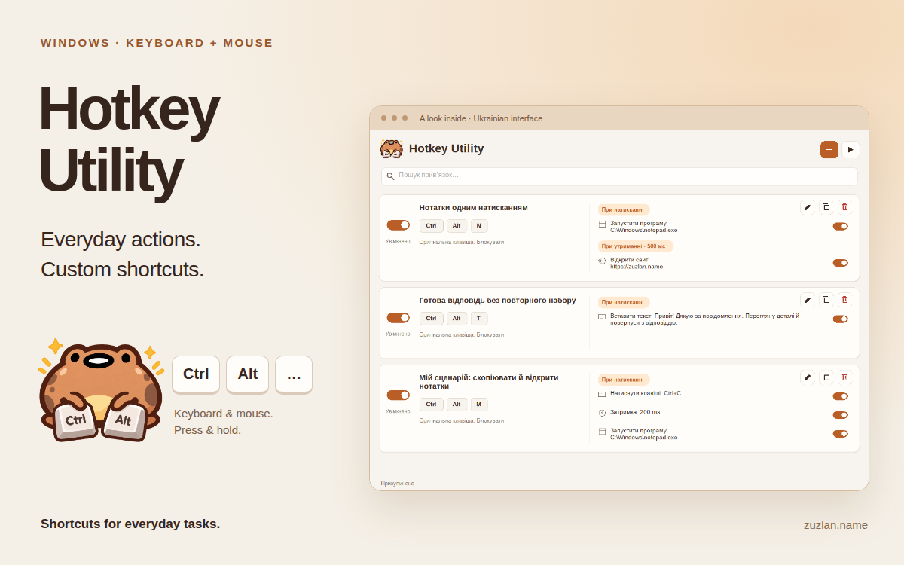
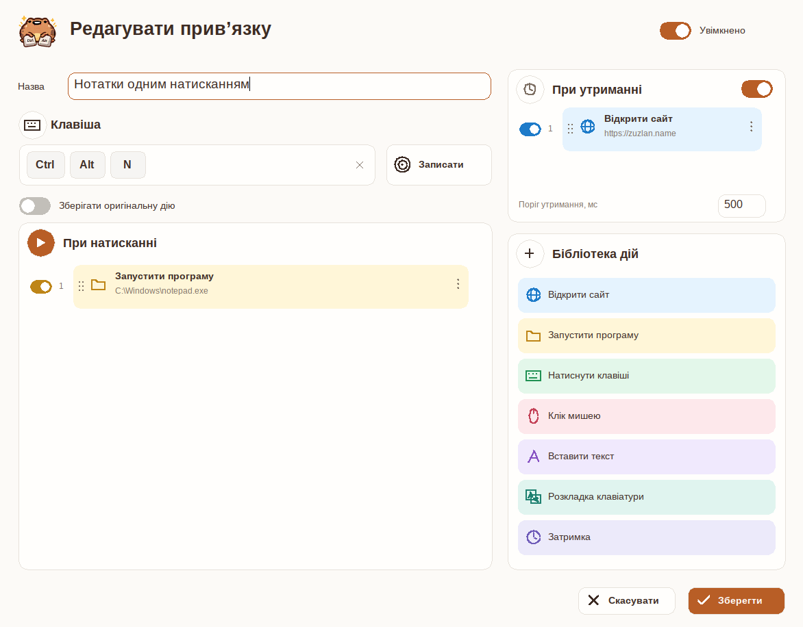

  

<h1 align="center">Hotkey Utility</h1>

<strong>Turn everyday Windows tasks into your own shortcuts.</strong>

Open apps. Insert saved replies. Build action sequences. Give a short press and a hold different jobs — without writing scripts.

  <a href="https://www.zuzlan.name/aupd/hotkey/HotkeyUtility.exe"><strong>Download for Windows ↓</strong></a>
  &nbsp;·&nbsp; <a href="docs/USER_GUIDE.md">User guide</a>
  &nbsp;·&nbsp; <a href="https://github.com/Zuzlan/HotkeyUtility/issues">Report an issue</a>

Windows 10/11 · 64-bit · Keyboard &amp; mouse · Seven interface languages

## Make the actions you repeat easier

| Your task | Your shortcut |
| --- | --- |
| Reuse a reply, signature or template | Insert saved text without changing your clipboard. |
| Give one combination two jobs | Tap to open your notes; hold to open a chosen website. |
| Return to an app already running | Activate its existing window, or launch it if it is closed. |
| Combine several steps | Put actions in order and add a delay where an app needs time to open. |
| Switch between keyboard layouts | Select a layout or return to the one you used previously. |

## One shortcut, two sequences

Build **On press** and **On hold** sequences side by side. Choose actions from the
library, drag them into order and turn individual steps on or off.

*The screenshots show the Ukrainian interface with example shortcuts.*

Available actions: **open a website**, **run or activate a program**, **send keys**,
**click the mouse**, **wait**, **insert text** and **switch keyboard layout**.

## Get started

1. [Download HotkeyUtility.exe](https://www.zuzlan.name/aupd/hotkey/HotkeyUtility.exe)
   from the author's website and run it.
2. Choose an installation folder and select **Install and open**.
3. Click **+**, name your shortcut and use **Record** to capture its trigger.
4. Add an action, set its parameters and save. Resume shortcuts if the utility
   is paused.

For a first shortcut, try **Insert text** with a reply you type often.
The [user guide](docs/USER_GUIDE.md) covers action settings, keyboard layouts,
search, backups and recovery.

## Keep control

- Pause shortcuts from the window or notification-area menu.
- **Ctrl+Alt+Backspace** stops running and queued actions and pauses the utility.
- Automatic updates are enabled by default; you can turn them off in **Options**.
- Settings stay in `config.xml` beside the application, with a backup copy.

Apps running as administrator and Windows-reserved shortcuts can limit
automation. After locking the computer or waking it from sleep, resume shortcuts
explicitly. With hold actions configured, a short press runs on release.

The interface supports English, Ukrainian, Georgian, Catalan, Spanish, French
and German.

## Help shape the next improvements

[Open an issue](https://github.com/Zuzlan/HotkeyUtility/issues) with the task you
want to automate, steps to reproduce a problem and your Windows version. Check
logs and screenshots for personal information before sharing them.

This repository contains product documentation, visuals and issue tracking.
Application source code is not included. Downloads are hosted on the author's
website.

[Product page](https://www.zuzlan.name/products/hotkeyutility) ·
[Contact the author](https://www.zuzlan.name/#contact)
